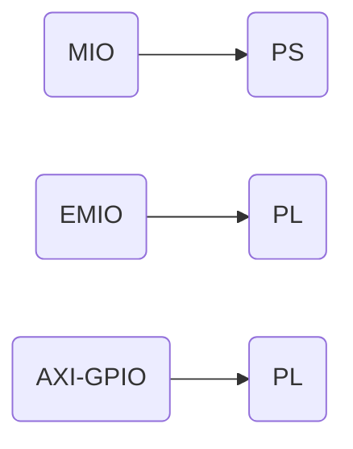

# ZYNQ学习

## 所用文档

ug1085和ug1137

## 内存映射

+ Global Address Map
  
  The global address map is composed of multiple inclusive address maps, depending on the address width of the interface master. The Zynq UltraScale+ MPSoC address map is 40 bits (the physical address space is a maximum of 40 bits).

## AXI4协议

### 握手

VALID和READY信号存在同时为高的时刻，握手即视为成功。

## MIO EMIO AXI-GPIO

## 分离的zynq系统

+ zImage(内核镜像)

+ system.dtb(设备树)

+ system.bit(bitstream文件)

+ BOOT.BIN(fsbl和uboot)

+ rootfs(跟文件系统)
  
  
