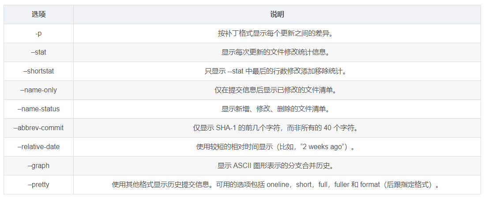
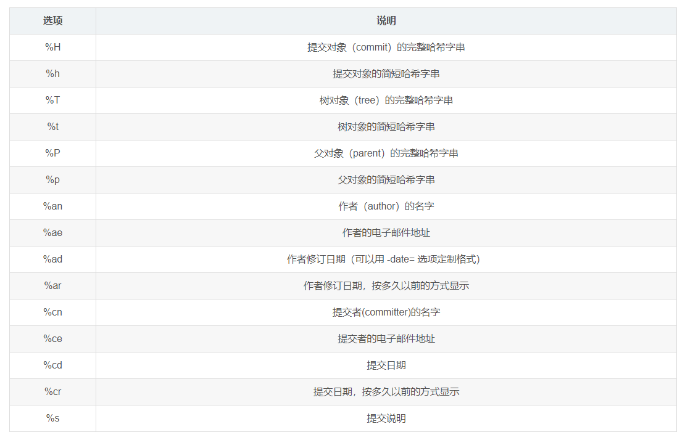

# git

## git密钥对

```shell
ssh-keygen -t ed25519 -C "your-email"
```

## git 提交文件

```git
git add xxxx/.
git commit -m 'xxxxxx'
git remote add origin git@github.com:xxxxx//创建远程仓库
git push origin  gh-pages //推送（可加-u参数简化之后推送）
```

## git删除分支

```git
git branch -d xxx
git branch --delete xxx
```

## git删除远程分支

```git
git branch -a //查看所有分支
git push origin -d xxx
```

## git分支处理

```git
git branch
git branch -r

//切换分支(新版本用switch)
git switch xxx
git checkout xxx
//切换并创建分支
git checkout -b xxx
git switch -c xxx

git log --graph --pretty=oneline --abbrev-commit    //显示分支结构
```

## git解决冲突

```git
git merge xxx      //从xxx分支merge到当前分支
git diff --check   //检查分支冲突
cat xxx            //查看文件
```

## git版本回退

```git
git log --pretty=oneline
git reset --hard //需要回退版本的key
git reset --hard HEAD^
reset --hard HEAD~ //需要回退版本次数
```

## git log使用

`git log --pretty=format:"%h - %an, %cd : %s" --graph`

### 一些参数

```git
git log -p -2 //仅显示最近两次更新
git log --stat //增改行数统计
git log --graph//显示分支图形
```



### 格式化

+ 简单模式

```git
git log --pretty=oneline
git log --pretty=short
git log --pretty=full
git log --pretty=fuller
```

+ 定制格式

```git
git log --pretty=format:"%h - %an, %cd : %s"
```


