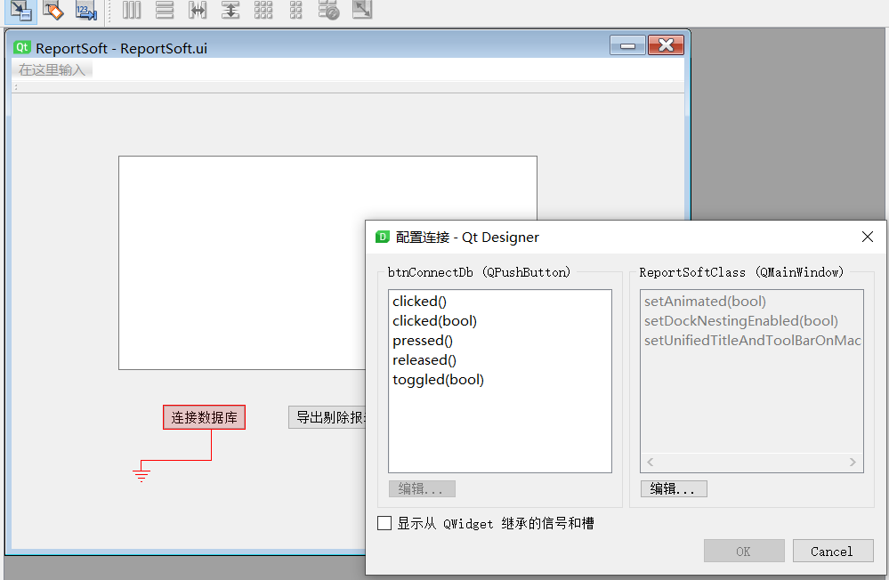

## Visual Studio + Qt槽的使用

+ 方法一：拖拽自定义槽
  
  
  
  

+ 方法二：代码方式
  
  ```
  connect(ui.btnReportEliminate,&QPushButton::clicked,this,&ReportSoft::connectDB);
  ```

## 对象树的用处

最主要作用为new开辟到堆中的对象不用手动delete，只需要对象继承父对象，当父对象析构时即可自动delete。

## 多线程

### 打印当前线程

```cpp
qDebug() << QThread::currentThreadId() << QThread::currentThread();
```

## 动态库和静态库

### 动态库

+ 显示调用
  
  显示调用不需要修改.pro文件，也不需要加头文件，主要是通过 QLibrary 方法
  
  ```
  1. #include xxx
  
  2. QLibrary mylib(“/xxx/xxx/xxx.dll”);
  
  3. 然后 if(mylib.load()) 通过load()函数去加载动态库 (加载后，库将保留在内存中
  ，直到应用程序终止。我们可以尝试使用 unload( ) 来卸载库)
  
  4. 声明函数指针，通过resolve得到库中函数地址
    typedef void (*Fun)();
    Fun method = (Fun)mylib.resolve(“method-name”);
    if(!method) //判断是否获取成功
  
  5. 最后再调用即可
  ```

+ 隐式调用（需要仔细再查查）
  
  放在环境变量路径
  
  程序路径

+ 不同编译器产生的后缀区别
  
  > MinGW xxx.a 
  
  > MSVC xxx.dll

## IDE使用

### VisualStudio 配置库

+ 添加附加包含目录
  
  **项目** --- **属性** --- **属性页** --- **C/C++** --- **常规**--- **附加包含目录**

+ 添加附加库目录
  
  **项目** --- **属性** --- **属性页** --- **链接器** --- **常规** --- **附加库目录**

+ 添加附加依赖项
  
  **项目** --- **属性** --- **属性页** --- **链接器** --- **输入** --- **附加依赖项**

### MSVC中文乱码

- 原因：qt creator文件使用的是UTF-8编码，但MSVC生成的可执行文件的编码是windows本地的字符集如GB2312

- 解决方法：
  
  > 1.使用QStringLiteral()宏封装字符串
  > 
  > 2.强制MSVC使用UTF-编码
  > 
  > ```
  > #pragma execution_character_set("utf-8")
  > ```
  > 
  > 3.全局方式
  > 
  > + 全局使用utf-8编码
  > 
  > + **项目** --- **属性** --- **属性页** --- **C/C++** --- **所有选项**--- **附加选项**`/utf-8`

### qmake拷贝文件文件夹到输出目录

```qmake
#配置中增加文件拷贝选项
CONFIG += file_copies

#定义需要增加的文件
# $$PWD表示工程源代码所在目录
# $$OUT_PWD表示发布软件坐在目录
# .files规定文件名或文件夹名
# .path规定发布目标地址
# addfile和adddir为自定义变量名称

addfile.files = $$PWD/filename
addfile.path = $$OUT_PWD/

adddir.files = $$PWD/dirname
adddir.path = $$OUT_PWD/

# COPIES增加需要拷贝的文件或文件夹
COPIES += addfile
COPIES += adddir
```
