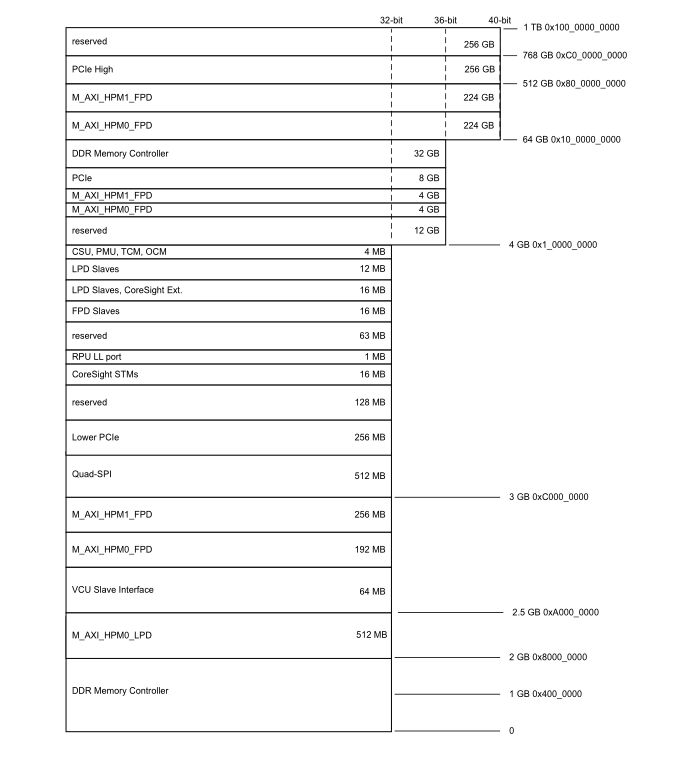
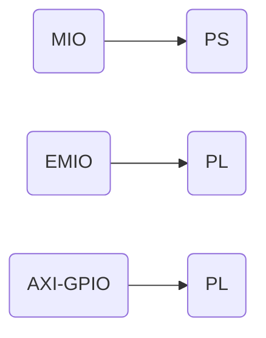

# ZYNQ学习

## 连接ZYNQ(不要忘记换成桥接)

+ nfs使用 

`mount -t nfs -o nolock 192.168.31.245:/home/zynq7020/linux/nfs /mnt`

+ ssh使用

`scp chrdevbaseApp chrdevbase.ko root@192.168.1.133:/lib/modules/4.14.0-xilinx`

## framebuffer驱动

mmap

```c
void* mmap(void* start,size_t length,int prot,int flags,int fd,off_t offset);
```

## 所用文档

ug1085和ug1137

## 内存映射

+ Global Address Map
  
  The global address map is composed of multiple inclusive address maps, depending on the address width of the interface master. The Zynq UltraScale+ MPSoC address map is 40 bits (the physical address space is a maximum of 40 bits).



## AXI4协议

### 握手

VALID和READY信号存在同时为高的时刻，握手即视为成功。

## MIO EMIO AXI-GPIO



## 分离的zynq系统

+ zImage(内核镜像)

+ system.dtb(设备树)

+ system.bit(bitstream文件)

+ BOOT.BIN(fsbl和uboot)

+ rootfs(跟文件系统)

## 编译内核

```shell
make ARCH=arm CROSS_COMPILE=arm-linux-gnueabihf- xilinx_zynq_defconfig //defconf 配置
make ARCH=arm CROSS_COMPILE=arm-linux-gnueabihf- menuconfig //配置内核
make ARCH=arm CROSS_COMPILE=arm-linux-gnueabihf- zImage -j16 //编译 zImage
make ARCH=arm CROSS_COMPILE=arm-linux-gnueabihf- system-top.dtb //编译设备树
```

## MobaXterm连接ZYNQ(不要忘记换成桥接)

+ nfs使用 

`mount -t nfs -o nolock 192.168.31.245:/home/zynq7020/linux/nfs /mnt`

+ ssh使用

`scp chrdevbaseApp chrdevbase.ko root@192.168.1.133:/lib/modules/4.14.0-xilinx`

## framebuffer驱动

mmap

```c
void* mmap(void* start,size_t length,int prot,int flags,int fd,off_t offset);
```

## 正点原子4384屏像素时钟

$$
\begin{split}
Total&=(VSPW+VBP+LINE+VFP) * (HSPW + HBP + HOZVAL + HFP)\\
&=(3 + 32 + 480 + 13) * (48 + 88 + 800 + 40)\\
&=528 * 976\\
&= 515328
\end{split}\\
515328 * 60 =3091960\approx31MHz
$$
