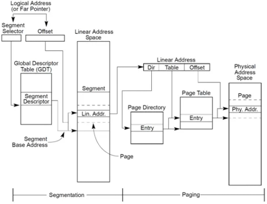
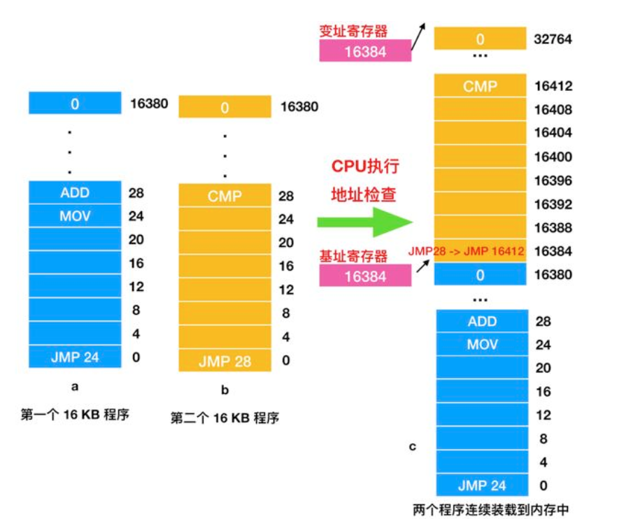
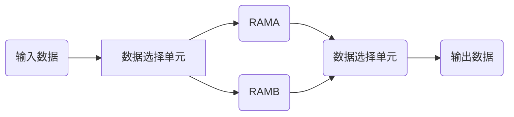

# 内存

## 内存基础

+ 逻辑地址 --- logical address;

+ 虚拟地址 --- virtual address;

+ 线性地址 --- linear address;

+ 物理地址 --- physical address; 

$\color{blue}{逻辑地址：[段选择符：段内偏移量]}$

$\color{blue}{虚拟地址：段内偏移量}$

$\color{blue}{线性地址：将逻辑地址经过页式转换而来}$

Linux系统不分段：

线性地址=逻辑地址=虚拟地址



## 动态重定位技术

基址寄存器（basic register）:储存起始位置

变址寄存器（limit register）：储存长度



## 因为内存不足出现的技术

+ 交换（swapping）技术:将空闲进程存储到磁盘

+ 虚拟内存（virtual memory）

## 虚拟内存


OS为每个进程分配一个4G虚拟空间(1G内核空间3G用户空间)。

内核空间占据虚拟空间的最高1GB地址，但映射到物理地址是从最低地址开始的（0x0000 0000）。

### （1）分段式


### （2）分页式

地址空间被分为多个称为页面（page）的块，每个页面一般为4KB。

虚拟地址映射为物理地址，由页表给出虚拟地址与物理地址之间的映射关系。内存管理单元(MMU）把虚拟地址转换为物理地址。

## 数据缓存

### 三种形式

+ 双口ram:一个SRAM上具有两套完全独立的数据线、地址线、读写控制线，允许两个独立系统同时进行随机访问。

+ FIFO：先入先出队列，不能随机访问。

+ 乒乓ram：两块RAM流水轮转



## ZYNQ开发

+ memcpy：拷贝内存

```c
#include<string.h>
void *memcpy(void *dest, const void *src, size_t n);
```

+ memset：初始化工作

```c
 #include<string.h>    //或 #include<memory.h>
 void *memset(void *s, int ch, size_t n);
```

+ malloc：动态分配内存，之后需要free()

```c
 #include <stdlib.h>    //或#include <malloc.h>
 extern void *malloc(unsigned int num_bytes);
```

## 关于cache

`Xil_DCacheEnable()` 和 `Xil_ICacheEnable()` 是 Xilinx 提供的函数，用于启用处理器的数据缓存和指令缓存。

`Xil_DCacheDisable();`  和 `Xil_ICacheDisable();`禁用缓存

启用缓存后修改内存数据和指令，缓存中的数据和指令可能会过期使用`Xil_DCacheFlush()` 和 `Xil_ICacheInvalidate()`刷新缓存
