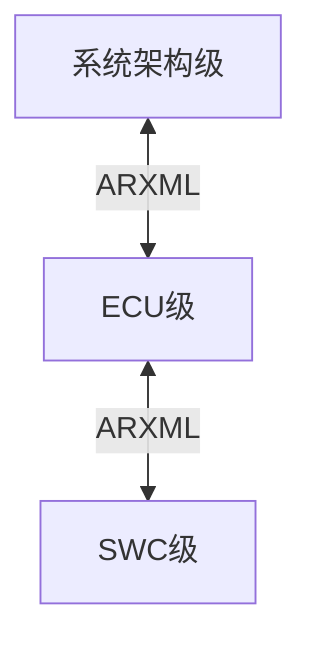
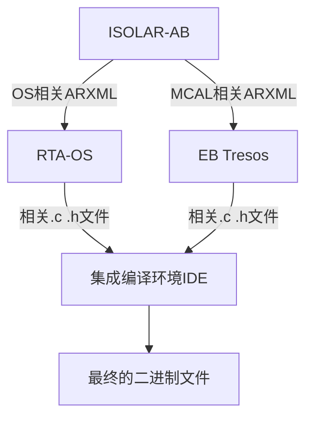

#  汽车开放系统架构（Automotive Open System Architecture）

## 分成AP和CP

+ AP:自适应平台autosarOS
  
  ```
  应用场景：面向主要面向高度智能化、联网化且功能需求不断变化的复杂应用场景
  硬件要求：对处理器要求较高，一般是运行在64位的高性能处理器（MPU）或CPU中
  操作系统：一般是兼容POSIX的操作系统，如LINUX
  ```

+ CP:经典平台autosar
  
  ```
  应用场景：面向汽车电子的基础控制领域
  硬件要求：对处理器要求不高，经常是运行在8 位、16 位、32 位的微控制器（MCU）中
  操作系统：一般采用实时操作系统RTOS
  ```

## 关于Autosar架构

详见该网址https://zhuanlan.zhihu.com/p/643415865

## Autosar CP

### 层级 

+ ASW 应用软件层

+ RTE 运行时环境

+ BSW 基础服务层

+ MCAL 微控制器抽象层

### 开发方法论



+ 系统架构级：整车级别的软件架构设计以及相关功能模块的定义
+ ECU级：开发单片机底层软件
+ SWC级：具体控制算法

### CP开发工具

+ ISOLAR-AB、RTA-BSW:配置BSW
+ RTA-OS:配置OS
+ RTA-RTE:配置RTE
+ EB Tresos:配置MCAL
+ S32DS、HighTec:集成编译环境



### MCAL开发流程

### PNG


### Trico+RTAOS模块的初始化

1.Mcal 相关的初始化，以及一些模块的PreInit


2.OS启动后默认启动的Task ECU_StartupTask上初始化

进行BswM_Init
