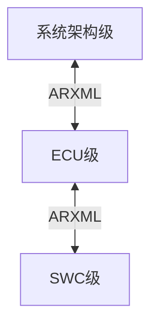
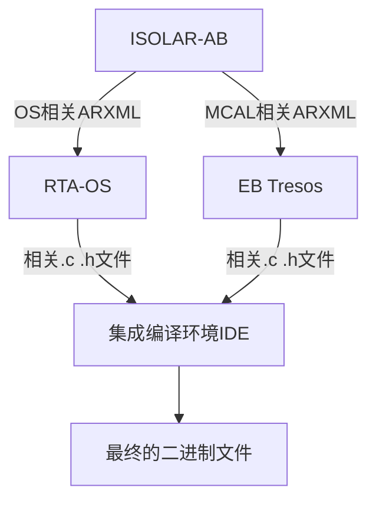
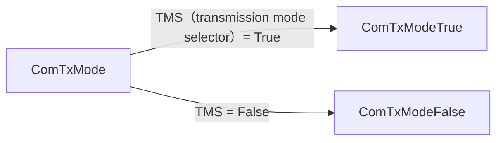

#  汽车开放系统架构（Automotive Open System Architecture）

## 分成AP和CP

+ AP:自适应平台autosarOS
  
  ```
  应用场景：面向主要面向高度智能化、联网化且功能需求不断变化的复杂应用场景
  硬件要求：对处理器要求较高，一般是运行在64位的高性能处理器（MPU）或CPU中
  操作系统：一般是兼容POSIX的操作系统，如LINUX
  ```

+ CP:经典平台autosar
  
  ```
  应用场景：面向汽车电子的基础控制领域
  硬件要求：对处理器要求不高，经常是运行在8 位、16 位、32 位的微控制器（MCU）中
  操作系统：一般采用实时操作系统RTOS
  ```

## 关于Autosar架构

详见该网址https://zhuanlan.zhihu.com/p/643415865

## Autosar CP

### 层级 

+ ASW 应用软件层

+ RTE 运行时环境

+ BSW 基础服务层

+ MCAL 微控制器抽象层

### 开发方法论



+ 系统架构级：整车级别的软件架构设计以及相关功能模块的定义
+ ECU级：开发单片机底层软件
+ SWC级：具体控制算法

### CP开发工具

+ ISOLAR-AB、RTA-BSW:配置BSW
+ RTA-OS:配置OS
+ RTA-RTE:配置RTE
+ EB Tresos:配置MCAL
+ S32DS、HighTec:集成编译环境



### MCAL开发流程

### PNG


### Tricore+RTAOS模块的初始化

1.Mcal 相关的初始化，以及一些模块的PreInit


2.OS启动后默认启动的Task ECU_StartupTask上初始化

进行BswM_Init

### COM模块

#### Signal的发送属性

+ Triggered：调用Com_SendSignal( )服务请求具备Triggered属性的信号发送，可以触发相关I-PDU的发送，但是发送模式配置为Periodic时，只更新信号的值，不会立即发送
+ Pending：Com_SendSignal( )服务请求调用具备Pending属性的信号发送，不会触发相关I-PDU的发送

#### I-PDU的发送模式：

+ Direct/n-times模式：
  包含于该I-PDU的任何具备Triggered属性的信号及信号组的更新都会触发I-PDU的立即发送，当上层面模块调用Com_SendSignal( )/Com_SendSignalGroup( )更新信号或者信号组时，Com层根据配置需求发送n次该I-PDU

+ Periodic模式：
  用户配置发送周期，只有该I-PDU的周期到来时才会触发该I-PDU的发送，上层模块调用Com_SendSignal( )/Com_SendSignalGroup( )只更新信号及信号组的内容

+ Mixed模式：
  Direct/n-times和Periodic的混合模式，当上层模块调用Com_SendSignal( )/Com_SendSignalGroup( )请求该I-PDU包含的信号/信号组的发送时，将会触发该I-PDU的直接n次发送，同时，用户配置的周期到来也会触发该I-PDU的发送

+ NONE模式：
  无论何时COM层不能够触发拥有该发送模式的I-PDU的发送，只有PduR模块调用Com_TriggerTransmit( )服务才能够触发该I-PDU的发送

#### ComTxMode



#### Signal的过滤机制

+ ALWAYS
  总是通过，若一个信号的过滤算法配置为ALWAYS，那么这个信号的TMC永远为True；

+ NEVER
  总是不通过，若一个信号的过滤算法配置为NEVER，那么这个信号的TMC永远为False；

+ MASKED_NEW_EQUALS_X
  若一个信号的过滤算法配置为MASKED_NEW_EQUALS_X时，只有当新值与掩码按位与之后等于设定的某一值时，这个信号的TMC才等于True；

+ MASKED_NEW_DIFFERS_X
  若一个信号的过滤算法配置为MASKED_NEW_DIFFERS_X时，只有当新值与掩码按位与之后不等于设定的某一值时，这个信号的TMC才为True；

+ MASKED_NEW_DIFFERS_MASKED_OLD
  若一个信号的过滤算法配置为MASKED_NEW_DIFFERS_MASKED_OLD时，只有当新值与掩码按位与之后的值不等于旧值与掩码按位与之后的值时，这个信号的TMC才为True；

+ NEW_IS_WITHIN
  若一个信号的过滤算法配置为NEW_IS_WITHIN时，只有当新值在某一设定的范围内时，这个信号的TMC才为True；

+ NEW_IS_OUTSIDE
  若一个信号过滤算法配置为NEW_IS_OUTSIDE时，只有当新值不在某一设定的范围内时，这个信号的TMC才为True；

+ ONE_EVERY_N
  若一个信号的过滤算法配置为ONE_EVERY_N时，该信号值每更新N次，这个信号的TMC值为True；

一个I-PDU的TMS的值是根据其所有下属的信号的TMC结果决定的，若一个I-PDU下属的信号中至少有一个信号的TMC计算为True，那么这个I-PDU的TMS为True，只有该I-PD下属的所有的信号的TMC都计算为False时，该I-PDU的TMS才为False。

### Configuration Class

[AUTOSAR参数配置类及变体概述_variant-pre-compile-CSDN博客](https://blog.csdn.net/jsls135/article/details/109851319)

+ Pre-compile time
+ Link time
+ Post-build time 


