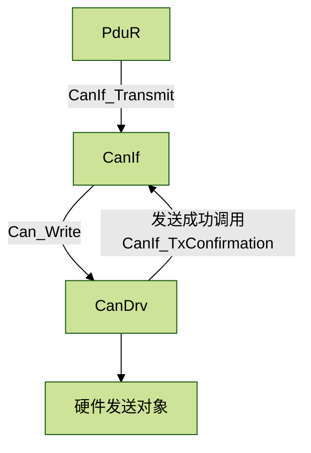
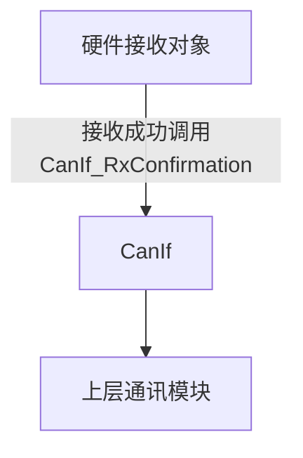
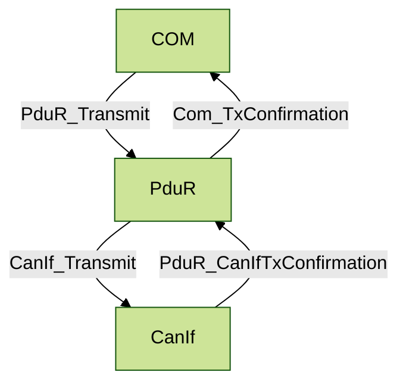
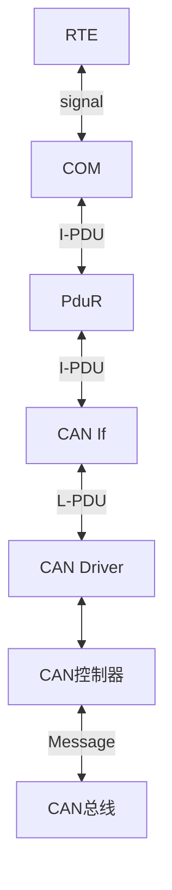
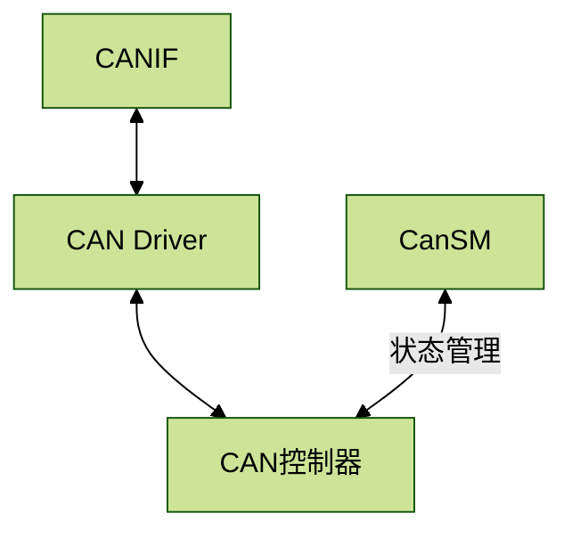

# CAN通讯

CAN（Controller Area Network）是20世纪80年代初德国Bosch公司为解决现代汽车中
众多控制单元、测试仪器之间的实时数据交换而开发的一种串行通信协议

## 特点

+ 双线差分信号
+ 电平（显性0，隐形1）
+ 多主站结构
+ 数据校验
+ 总线访问：非破坏性仲裁的载波侦听多路访问/冲突检测CSMA/CD (Carrier Sense Multiple Access/Collision Detection)

+ NRZ编码与位填充

## 帧格式

+ 数据帧：携带从发送节点至接收节点的数据
+ 远程帧：向其他节点请求发送具有同一标识符的数据帧
+ 帧间空间：数据帧（或远程帧）通过帧间空间与前述的各帧分开
+ 错误帧：节点检测到错误后发送错误帧
+ 超载帧：在先行的和后续的数据帧（或远程帧）之间附加一段延时

### 数据帧

### 远程帧

### 帧间空间

### 错误帧

+ 主动错误

+ 被动错误!

  

### 超载帧

## 位定时与同步

### 位时间

### 位同步

+ 硬同步

  

+ 重同步

  通过加长 PES1 段，或缩短 PES2 段，以调整同步

### 简写

NBT（Nominal Bit Time） 标称位时间

$T_q$（Time Quantum）

## SAEJ1939

### PDU(Protocol Data Unit)

#### 构成

优先级 优先级P 、保留位R 、数据页DP 、PDU 格式PF、 PDU 细节PS 、源地址SA和数据场

### PGN (Parameter Group Number)

#### 用处

唯一的标识一个特定的参数组

#### 构成

### SPN 可疑参数编号

## CANIF模块

### 发送

### 接收

## PduR

## 数据流程

## 状态管理

## CAN大小端

### Intel格式 (小端模式)

**核心要诀：LSB在低字节的低位，MSB在高字节的高位**

### Motorola格式 (大端模式)

**核心要诀：LSB在高字节的低位，MSB在低字节的高位**

==两者只有在跨字节的情况下才有区别==

## DBC文件设计

+ Value Table是设置信号的默认枚举值，作为引用参考
