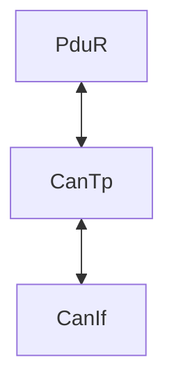

### 相关名词

**UDS**（Unified Diagnostic Services）统一诊断服务，是 ISO 14229 标准定义的一套诊断通信协议

**Dem**（Diagnostic event manager）

**Dcm**（Diagnostic communication manager）

**Fim**（Function Inhibition Manager）功能禁止管理模块

**DTC**（Diagnostic Trouble Code）诊断故障码

### DCM

#### 子模块

+ Dsl(Diagnostic Session Layer)

+ Dsd(Diagnostic Service Dispatcher)
+  Dsp(Diagnostic Service Processing)

### DEM

诊断服务栈负责诊断事件及其相关数据处理和存储的模块。

### CanTP

用于对Can I-PDU进行==分段==和==重新组装==，CanTp 只处理传输协议帧(即SF、FF、CF 和FC PDU)

### 错误判断机制

连续错误（CONSECUTIVE FAULT）

偶发错误（CAUSAL FAU）

